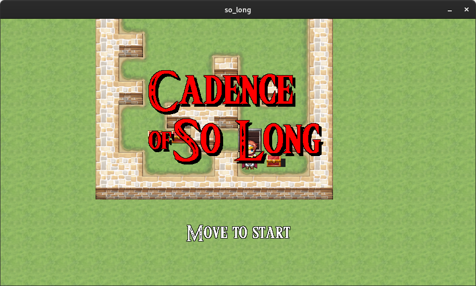
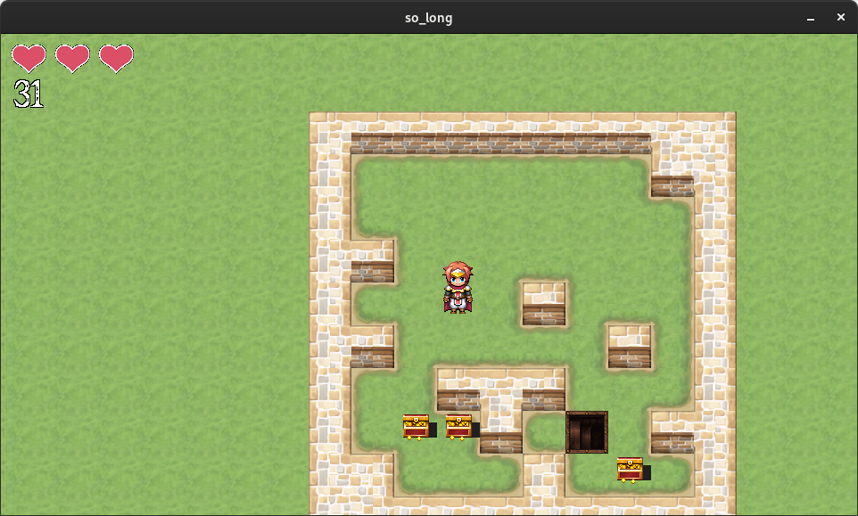
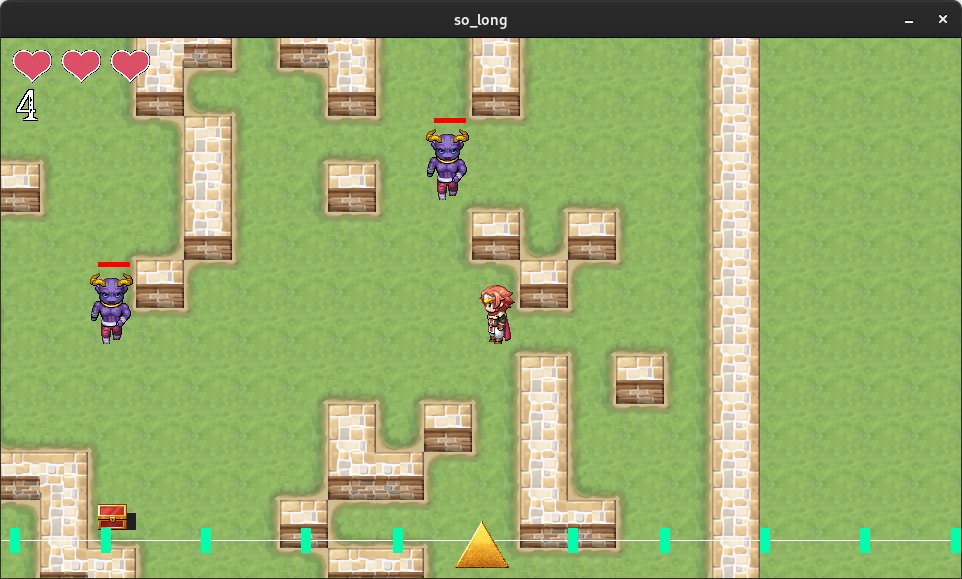

#so_long

**so_long** est un projet développé dans le cadre de mon cursus à l'école 42. Il s'agit d'un mini-jeu en 2D, conçu en utilisant la bibliothèque graphique MiniLibX. Ce projet m'a permis de mettre en pratique des compétences en programmation tout en créant une version améliorée de la MiniLibX, disponible ici : [MiniLibX-Extended](https://github.com/leofarhi/MiniLibX-Extended).



## Fonctionnalités

Ce jeu propose deux versions distinctes, chacune offrant une expérience de jeu unique :

### Version Normale

- **Objectifs** : Le joueur doit collecter tous les coffres (collectibles) avant que la porte de sortie ne s'ouvre.
- **Éléments du jeu** : 
  - Joueur
  - Coffres
  - Collectibles
  - Sortie
  - Murs

### Version Bonus

- **Nouveaux défis** : En plus des éléments de la version normale, cette version introduit des monstres qui poursuivent le joueur.
- **Mécanique de rythme** : Pour vaincre les monstres, le joueur doit se positionner à côté d'eux et avancer vers eux en synchronisation avec une barre de rythme située en bas de l'écran. Une action au mauvais moment infligera des dégâts au joueur, tandis qu'une action réussie éliminera le monstre après 3 coups.

## Installation et Compilation

Pour tester **so_long**, vous pouvez télécharger le projet et le compiler en suivant les étapes ci-dessous :

1. **Version Normale** :
   - Compilez le jeu en exécutant la commande `make`.
   - Lancez le jeu avec `./so_long maps/[votre_map].ber`.
   
2. **Version Bonus** :
   - Si vous avez compilé la version normale, nettoyez les fichiers avec `make clean`.
   - Compilez la version bonus avec `make bonus`.
   - Lancez le jeu avec `./so_long maps/[votre_map].ber`.

## Génération de Cartes

Vous avez également la possibilité de créer vos propres cartes personnalisées :

- Utilisez le générateur de cartes intégré en exécutant le script suivant : 
  ```bash
  python map_generator.py
  ```
- Une fois la carte générée (`g_map.ber`), lancez-la avec :
  ```bash
  ./so_long maps/g_map.ber
  ```

## Contrôles

- **Déplacement** : Utilisez les touches fléchées ou les touches WASD pour déplacer le personnage.





